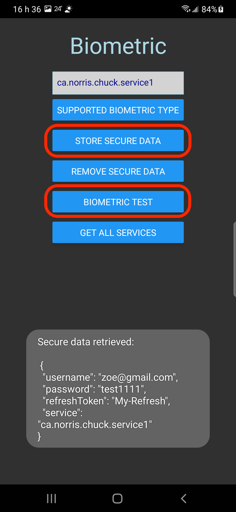
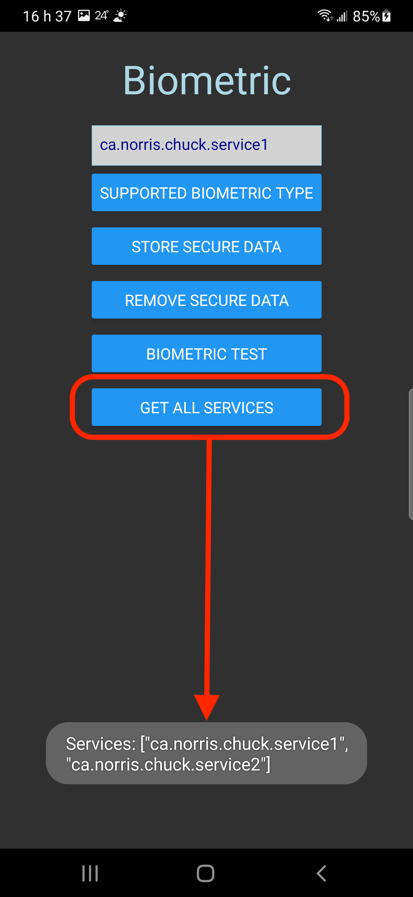

# poc-react-native-keychain

POC ReactNative implementation of react-native-keychain.

## Buttons

- [Supported biometric type]: list supported biometric types of the current device
- [Store secure data]: store JSON data under the given logical service name
- [Remove secure data]: removed data stored under the given logical service name
- [Biometric test]: try to retrieve the secured data throught device biometric method
- [Get all services]: list all logical service names

  
  

## Scripts

- `npm start`
- `npm run android`
- `npm run ios`
